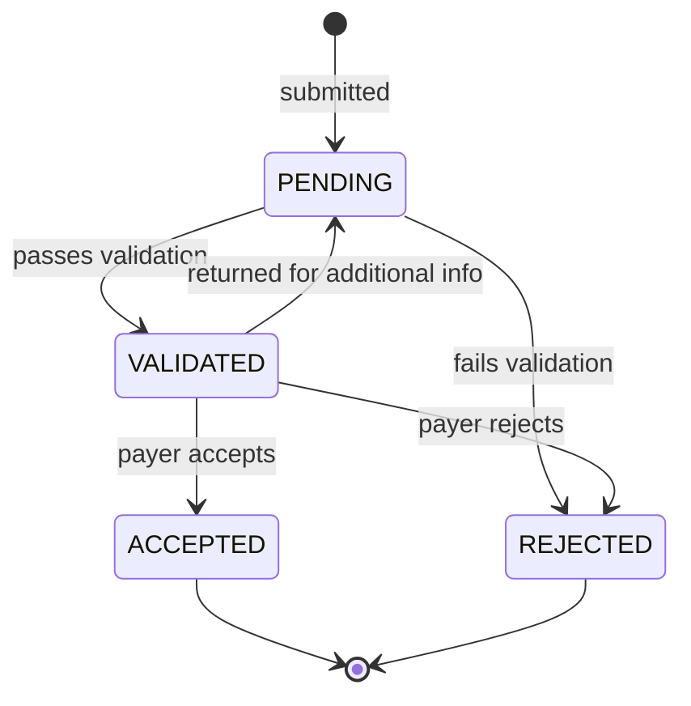

# Architecture

## Overview

The service is a FastAPI application backed by a SQLite database (via SQLAlchemy async). It handles claim submission, procedure code validation, and status lifecycle management for dental insurance claims. The frontend is a React SPA that communicates with the backend exclusively through the REST API.

---

## Module Map

```
src/
├── app.py                    # FastAPI application entrypoint, lifespan (DB init)
├── api/
│   └── routes.py             # All HTTP route handlers
├── services/
│   ├── claim_service.py      # Claim persistence and status transition logic
│   └── validation_service.py # Procedure code validation against allowed codes/amounts
├── models/
│   ├── base.py               # SQLAlchemy declarative base
│   ├── claim.py              # Claim model + ClaimStatus enum
│   ├── procedure.py          # Procedure model (line items on a claim)
│   └── payer.py              # Payer model (insurance company)
└── common/
    ├── db.py                 # Async engine, session factory, DB init
    ├── exceptions.py         # Domain exception types
    └── constants.py          # File paths and shared constants
```

---

## Data Model

### Claim

The central entity. Scoped to a `practice_id` — all queries filter by this field.

| Field | Type | Notes |
|---|---|---|
| `id` | integer | Primary key |
| `practice_id` | string | Tenant identifier — all queries are scoped to this |
| `patientName` | string | |
| `payer_id` | integer | FK → Payer |
| `status` | ClaimStatus | Current lifecycle state |
| `totalAmount` | float | Sum of procedure amounts |
| `created_at` | datetime | Set on insert |
| `updated_at` | datetime | Updated on every write |
| `procedures` | Procedure[] | Line items (loaded via relationship) |

### Procedure

A line item on a claim. Each procedure maps to a CDT code.

| Field | Type | Notes |
|---|---|---|
| `id` | integer | Primary key |
| `claimId` | integer | FK → Claim |
| `code` | string | CDT procedure code (e.g. `D0120`) |
| `description` | string | |
| `amount` | float | Billed amount for this procedure |

### Payer

An insurance company. Used to associate a claim with the payer responsible for adjudication.

| Field | Type | Notes |
|---|---|---|
| `id` | integer | Primary key |
| `name` | string | Display name |
| `payerCode` | string | Unique short code identifier |

---

## Claim Status Lifecycle

Claims move through the following states:



**Terminal states:** `ACCEPTED` and `REJECTED` — no further transitions are allowed once reached.

### Transition Table

| From | To | Condition |
|---|---|---|
| `PENDING` | `VALIDATED` | All `procedures.code` values exist in the allowed code set AND all `procedures.amount` values are within the allowed maximum for that code |
| `PENDING` | `REJECTED` | Any `procedures.code` is unrecognized OR any `procedures.amount` exceeds the allowed maximum |
| `VALIDATED` | `ACCEPTED` | Payer confirms adjudication — no field condition, manual trigger |
| `VALIDATED` | `REJECTED` | Payer denies — no field condition, manual trigger |

### Business Rules

- A `PENDING` claim must have all procedure codes validated against the allowed code set before it can be marked `VALIDATED`. If any procedure fails, the claim moves to `REJECTED`.
- A `VALIDATED` claim may be returned to `PENDING` if the payer requests additional documentation or corrections before making a decision. *(Not yet implemented.)*
- Once a claim reaches `ACCEPTED` or `REJECTED`, no further status changes are permitted.
- A `REJECTED` claim cannot be re-submitted or re-opened — a new claim must be created.
- `totalAmount` on a claim is the sum of its procedure amounts and must stay consistent with the procedures attached to the claim.

---

## Key Flows

### Claim Submission

1. Client POSTs to `/api/claims` with patient info, payer, and a list of procedures
2. `ValidationService` checks each procedure code against `data/procedure_codes.json` — validates the code exists and that the billed amount does not exceed the allowed maximum
3. If validation passes, `ClaimService.create_claim()` persists the claim and its procedures in a single transaction
4. The new claim is returned with status `PENDING`

### Status Transitions

1. Client PATCHes `/api/claims/{id}/status` with the desired new status
2. The route handler checks the requested transition is allowed from the current state
3. If allowed, the claim status is updated and the updated claim is returned

### Practice Scoping

Every read and write is scoped to a `practice_id`. A claim belonging to practice A is not visible to practice B. The `ClaimService` enforces this at the query level for all standard operations.

---

## Procedure Code Reference

Allowed procedure codes and their maximum billed amounts live in `data/procedure_codes.json`. The validation service loads this file at initialization. All payers currently share the same allowed code set.

---

## Frontend

The React frontend (`frontend/src/`) has three pages:

| Page | Route | Description |
|---|---|---|
| `ClaimList` | `/` | Lists all claims for the active practice |
| `ClaimDetail` | `/claims/:id` | Claim details and status update controls |
| `SubmitClaim` | `/submit` | Form to submit a new claim |

The Vite dev server proxies `/api/*` to `http://localhost:8000`, so the frontend never needs to know the backend URL directly.
