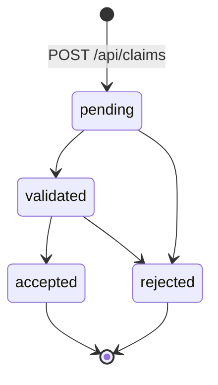

# Claim Lifecycle

A claim moves through four states. `accepted` and `rejected` are terminal: once reached, no
further transition is permitted, and there is no reopen path — the domain rule is that a
rejected claim is replaced by a new claim, not revived.

Claims are always created in `pending`; `POST /api/claims` ignores any client-supplied status.

## Two transition tables

The permitted moves are declared in two places, and they do not agree:

| From | To | `routes.py` (HTTP) | `claim_service.VALID_TRANSITIONS` |
|---|---|---|---|
| `pending` | `validated` | allowed | allowed |
| `pending` | `rejected` | **rejected (400)** | allowed |
| `validated` | `accepted` | allowed | allowed |
| `validated` | `rejected` | allowed | allowed |
| `accepted` | anything | rejected | rejected |
| `rejected` | anything | rejected | rejected |

`PATCH /api/claims/{id}/status` checks its own inline table and then assigns
`claim.status` directly, so `ClaimService.transition_status()` — and the
`InvalidStatusTransitionError` it raises — is never reached through HTTP. The service method is
exercised only by the tests in `tests/test_claim_service.py`.

The practical consequence is that `pending → rejected` succeeds when called through the service
layer and returns `400 Invalid status transition` when called through the API. The claim detail
page in the frontend shows a "Reject Claim" button on pending claims, which takes the API path
and therefore fails; the handler does not check the response, so the UI refetches and silently
displays the unchanged status.

## Validation is not a transition trigger

ARCHITECTURE.md describes `pending → validated` as conditional on every procedure code and
amount passing validation. In the implementation, validation runs once at submission time
(`POST /api/claims`) and rejects the request outright if it fails — see
[Validation](validation.md). By the time a claim exists, its procedures have already passed.

The status transition itself performs no validation. `pending → validated` is an unconditional
manual move, as are `validated → accepted` and `validated → rejected`.

## `validated → pending`

ARCHITECTURE.md describes returning a validated claim to `pending` when the payer requests
additional documentation, and marks it as not yet implemented. That remains accurate: neither
transition table includes it, so the API returns `400`.

## Where the timestamps come from

`updated_at` has `onupdate=func.now()`, so any committed change to a claim row — including a
status change — refreshes it. `created_at` is set once by `server_default`.
